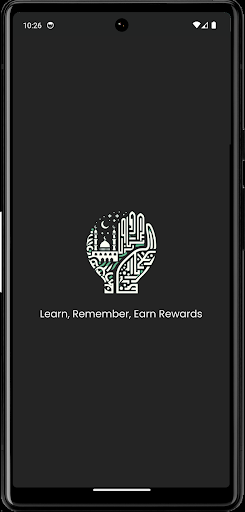
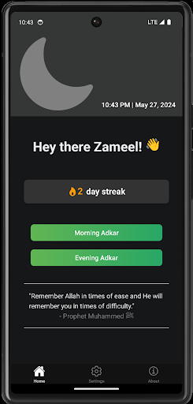
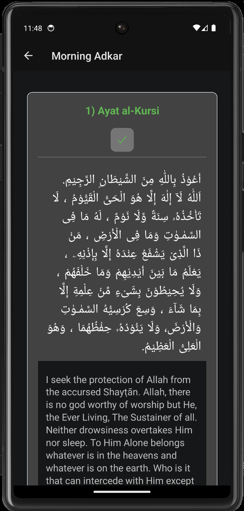

<div align="center">
  <picture>
 <source media="(prefers-color-scheme: dark)" srcset="./Screenshots/light-logo.png" width="100px">
 
</picture>
  <h1>Adkar Champ</h1>
</div>

<br>

<div align="center">


[](https://github.com/zameel7/adkar-streak/blob/main/LICENSE.md)


[](https://www.buymeacoffee.com/zameel7)

</div>

<div align="center">
  <a href='https://play.google.com/store/apps/details?id=com.zameel7.adkarstreak&pcampaignid=pcampaignidMKT-Other-global-all-co-prtnr-py-PartBadge-Mar2515-1'>
    
  </a>
</div>

<div align="center">Welcome to Adkar Champ! This app is designed to help you remember Allah and keep track of your daily adkar. We also have streaks to keep you motivated. If you like our app, please consider supporting me by buying me a coffee. <br><br><b>Jazakallah Khair!</b></div>
<br>

## Screenshots

<div align="center">
  
  
  
</div>

## Development

1. **Install dependencies**

    ```bash
    npm install
    ```

2. **Start the app**
    ```bash
    npx expo start
    ```

> For iOS development, please switch to the `ios` branch as LinearGradient is not supported in iOS.

In the output, you'll find options to open the app in a

-   [Development build](https://docs.expo.dev/develop/development-builds/introduction/)
-   [Android emulator](https://docs.expo.dev/workflow/android-studio-emulator/)
-   [iOS simulator](https://docs.expo.dev/workflow/ios-simulator/)
-   [Expo Go](https://expo.dev/go), a limited sandbox for trying out app development with Expo

## Todo

- [ ] Reiterate on how the streak should be calculated?
- [ ] Update adkar list from current to those from Hisnul Muslim
- [ ] Add transliteration and virtue for each adkar and turn off and on from settings
- [ ] Add a modal or welcome screen for the first time users to explain how app works
- [ ] Undo mark read for hadees
- [ ] Adkar card swipe should auto scroll to top
- [ ] Add a feature to share the app
- [x] Add a toggle to switch between light and dark mode
- [ ] Change font size from settings
- [ ] Turn off and on translations from settings
- [ ] Add hijri calendar tab
- [x] Change the date in the header to hijri date
- [ ] Add translation option in settings and Malayalam translation for adkar
- [ ] Add a widget for the home screen
- [ ] Adkar card header should have a progress for adkar completion
- [ ] Better UI/UX for the entire app

## Contributing

Contributions are always welcome! Please read the [contribution guidelines](./CONTRIBUTING.md) first.

<br>

<span style="color: #9998;">Google Play and the Google Play logo are trademarks of Google LLC.</span>
